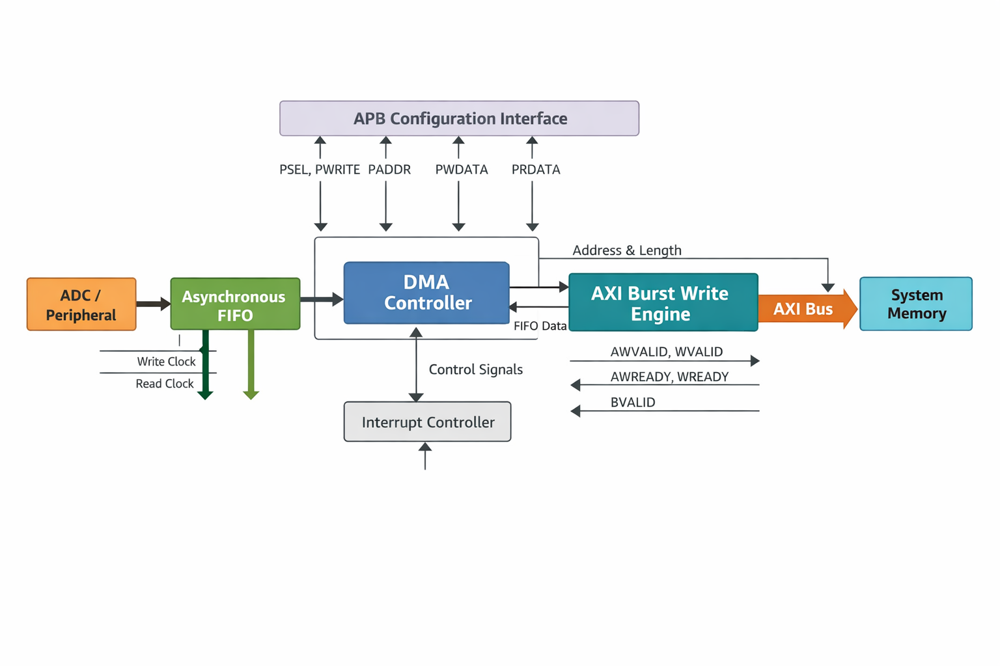
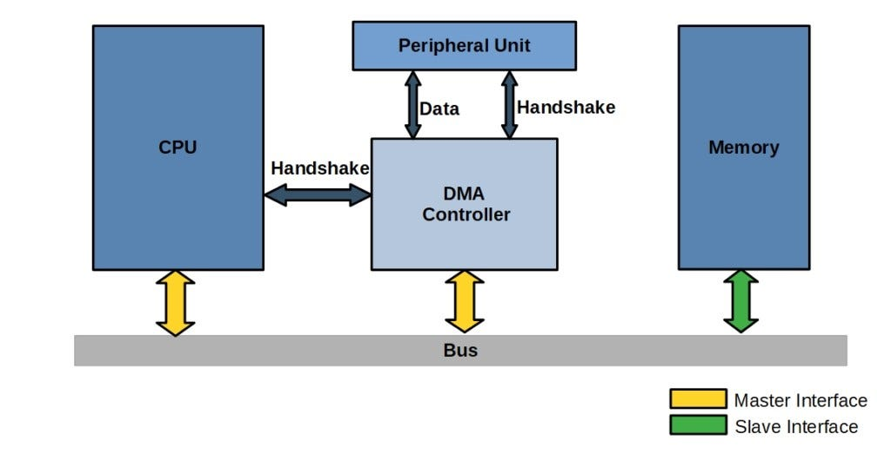
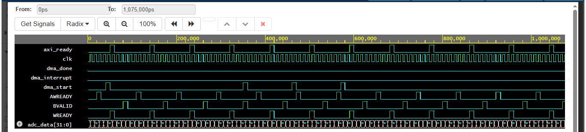

# AXI DMA Controller RTL Design
RTL implementation of an AXI DMA (Direct Memory Access) Controller in Verilog featuring APB-based configuration, control FSM, asynchronous FIFO buffering, and AXI4 burst write engine. The design demonstrates end-to-end DMA data flow from ADC input through FIFO buffering to AXI memory transactions with interrupt generation and full testbench verification.

The DMA is configured using an APB interface and controlled by an internal FSM that manages the transfer flow and interrupt generation.

---

## Project Overview

Modern SoCs require high-speed data movement between peripherals and memory without CPU intervention.  
This project implements a DMA controller that:

• Receives streaming data from an ADC  
• Buffers data using an asynchronous FIFO  
• Performs AXI burst memory writes  
• Uses APB for configuration and control  
• Generates interrupt after transfer completion

The design models a **real hardware data path used in embedded and FPGA-based systems**.

---

## System Architecture

ADC → Async FIFO → DMA Controller → AXI Burst Engine → Memory

APB Interface → DMA Configuration Registers

---
### Components

APB Interface
- Used to configure DMA registers
- Controls DMA start and parameters

DMA Controller
- Finite State Machine controlling the DMA operation
- Manages FIFO read/write operations
- Generates interrupt on transfer completion

Asynchronous FIFO
- Buffers streaming ADC data
- Handles safe data movement between modules
- Prevents overflow and underflow

AXI Burst Engine
- Performs AXI write transactions
- Handles burst transfers to memory
- Works with AXI ready/valid handshake protocol

Interrupt Controller
- Signals completion of DMA transfer

## Block Diagram

This diagram shows the integration of:

• APB configuration module  
• DMA control FSM  
• Asynchronous FIFO  
• AXI burst write engine

---

## Data Flow

Operational flow:

1. CPU configures DMA through APB
2. DMA start command issued
3. ADC generates streaming data
4. Data stored in asynchronous FIFO
5. DMA reads FIFO data
6. AXI burst write transfers to memory
7. Interrupt raised after completion

---

## Simulation Waveform

Waveform verifies:

• FIFO write/read operations  
• AXI handshake signals  
• DMA start and completion  
• Interrupt generation  
• Burst data transfers

---

## Repository Structure
axi-dma-controller-rtl
│
├── rtl
│   ├── apb_block.v
│   ├── async_fifo.v
│   ├── dma_controller.v
│   ├── dma_burst_engine.v
│   └── dma_top.v
│
├── tb
│   └── dma_top_tb.v
│
├── docs
│   ├── dma_block_diagram.png
│   ├── dma_dataflow.png
│   └── waveform.png
│
└── README.md

---

## Modules Description

### 1. DMA Top
Integrates all submodules and connects FIFO, controller, and AXI engine.

### 2. APB DMA Config
Implements configuration registers accessible through APB.

Controls:
• DMA start
• Transfer parameters
• Status monitoring

### 3. Asynchronous FIFO
Handles clock domain crossing between:
ADC clock domain and AXI clock domain.

Ensures:
• Data integrity
• Continuous streaming
• Safe synchronization

### 4. DMA Controller
Finite State Machine controlling:

• FIFO read/write
• DMA start/stop
• Transfer monitoring
• Interrupt generation

### 5. AXI Burst Engine
Performs AXI4 write transactions:

• Address phase
• Data phase
• Response handling

Supports burst-based memory transfer.

---

## Protocols Used

### APB (Advanced Peripheral Bus)

APB is used for low-power configuration and register access.

Key signals:
• PSEL
• PENABLE
• PWRITE
• PADDR
• PWDATA

Used for:
DMA control and configuration.

---

### AXI4 (Advanced eXtensible Interface)

AXI enables high-performance memory communication.

Key channels used:

Write Address Channel  
Write Data Channel  
Write Response Channel

Features:
• Burst transfers
• High bandwidth
• Pipelined transactions

---

## DMA Operation Flow

1. APB configures DMA parameters
2. DMA start signal asserted
3. ADC sends continuous data
4. Data buffered in async FIFO
5. DMA controller triggers AXI writes
6. AXI engine performs burst transfers
7. Transfer completes
8. DMA interrupt generated

---

## Simulation Environment

Simulator:
EDA Playground

Tool:
Icarus Verilog

Verification includes:
• Functional validation
• Protocol handshake checks
• Data transfer correctness
• Interrupt validation

---

## How to Run Simulation

1. Open EDA Playground
2. Upload RTL files in design section
3. Upload testbench in testbench section
4. Select Icarus Verilog
5. Run simulation
6. View waveform in EPWave
   
EDA Playground Link:
https://www.edaplayground.com/x/WcWC

---
## Technologies Used

Verilog HDL  
AXI Protocol  
APB Protocol  
RTL Design  
FPGA/ASIC Design Flow

## Design Highlights

• Realistic DMA architecture  
• Clean modular RTL design  
• Industry-standard bus protocols  
• Clock domain crossing handled safely  
• Testbench covering complete flow  
• GitHub-ready documentation

---

## Future Improvements

Planned enhancements:

• SystemVerilog assertions
• UVM-based verification
• AXI read channel support
• Scatter-gather DMA
• Performance optimization
• Parameterized burst lengths

---

## Author

Sravanthi Vangara  
VLSI Design Enthusiast | RTL Design | Digital Systems

